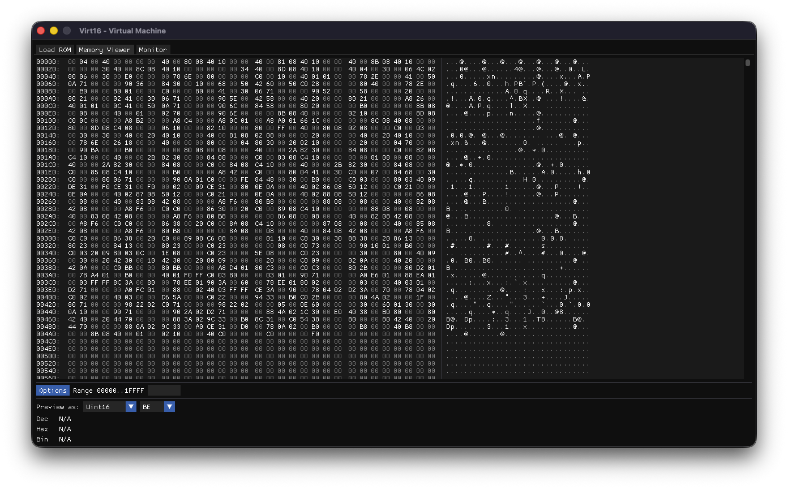
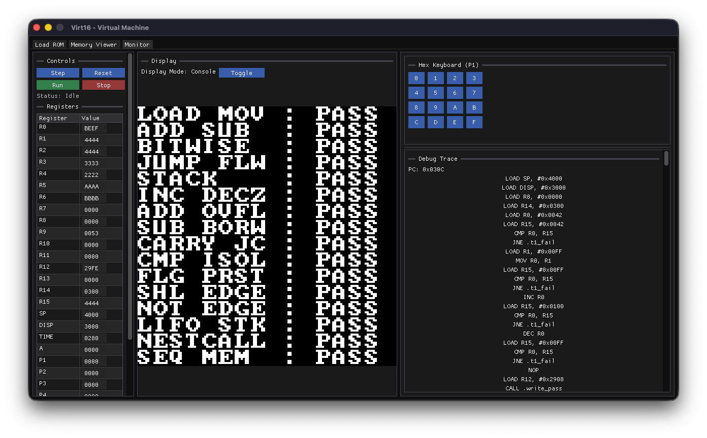

# Virt16 - A 16 bit toy computer

The Virt16 is a virtual 16-bit computer that is designed to be simple and easy to understand.

**3D Cube Rendering Example:**

https://github.com/user-attachments/assets/cc7e20fe-586b-46b8-ade4-8f97befdafab

**Memory Visualizer and Display Output:**
| Memory Map | Console Mode |
| :---: | :---: |
|  |  |

## Architecture
- **Word size**: 16 bits (2 bytes)
- **Memory size**: 128KB (65,536 words × 2 bytes)
- **Architecture type**: Von Neumann architecture (program and data share the same memory)

## Memory
- **Words**: 65,536 (2 bytes each)
- **Address range**: 0x0000 - 0xFFFF

## Display (In Memory DMA)
- **Display Memory**: 0x3000 - 0x3FFF (4KB)

## Registers
- **State Registers**:
  - `PC`: Program Counter (RESERVED)
  - `SP`: Stack Pointer (RESERVED)
- **Time Register**:
  - `TIME`: Time Register
- **Accumulator**:
  - `A`: Accumulator
- **General Purpose Registers**:
  - `R0` - `R15`: General Purpose Registers
- **Peripheral Registers**:
  - `P1` - `P4`: Peripheral Registers (16 bits each)
- **Video Address Register**:
  - `DISP`: Display Register (Contains Address of Current Display Memory)
- **Interrupt Registers**:
  - `TVEC`: Timer Interrupt Vector (address of timer ISR)
  - `KVEC`: Keyboard Interrupt Vector (address of keyboard ISR)
  - `TPER`: Timer Period (TIME resets and fires when TIME == TPER; 0 = disabled)
- **Flag Register**:
  - `Z`: Zero Flag (Set automatically when an arithmetic result is zero)
  - `G`: Greater Than Flag
  - `L`: Less Than Flag
  - `E`: Equal Flag
  - `C`: Carry / Borrow Flag
  - `I`: Interrupt Enable Flag (set by EI, cleared by DI or on interrupt entry)

## Instruction Set
- **OPCODE**: 5 bits (0x00 - 0x1F)
- **REGISTER**: 5 bits (0x00 - 0x17)
- **IMMEDIATE**: 16 bits (0x0000 - 0xFFFF)
- **Instruction Size**: every instruction is exactly 2 words (32 bits)

### Instructions
- `LOAD X, #imm`: Load immediate value into register X
- `LOAD X, Y`: Load from memory at the address held in Y into X
- `STORE X, Y`: Store register Y into memory at the address held in X
- `MOV X, Y`: Move value from Y to X
- `INC X`: Increment X by 1
- `DEC X`: Decrement X by 1
- `ADD X, Y, Z`: Add Y and Z, store result in register X; sets C on overflow, Z if result is zero
- `SUB X, Y, Z`: Subtract Z from Y, store result in register X; sets C on borrow, Z if result is zero
- `AND X, Y, Z`: Bitwise AND Y and Z and store in X
- `OR X, Y, Z`: Bitwise OR Y and Z and store in X
- `XOR X, Y, Z`: Bitwise XOR Y and Z and store in X
- `NOT X, Y`: Bitwise NOT Y and store in X
- `SHL X, Y, Z`: Shift Y left by Z bits and store in X
- `SHR X, Y, Z`: Shift Y right by Z bits and store in X
- `CMP X, Y`: Compare X and Y; resets E/G/L then sets the appropriate flag
- `JMP addr`: Jump to address
- `JZ addr`: Jump if zero
- `JE addr`: Jump if equal
- `JNE addr`: Jump if not equal
- `JG addr`: Jump if greater
- `JL addr`: Jump if less
- `JC addr`: Jump if carry flag is set
- `CALL addr`: Call subroutine
- `RET`: Return from subroutine
- `PUSH X`: Push value from register onto stack
- `POP X`: Pop value from stack into register
- `HLT`: Halt the program
- `NOP`: No Operation
- `EI`: Enable interrupts (sets I flag)
- `DI`: Disable interrupts (clears I flag)
- `RETI`: Return from interrupt (like RET, but also sets I flag)

## Assembler
### Opcode Translation Table
| OPCode | Instruction      | Description                                      | Example               |
|--------|------------------|--------------------------------------------------|-----------------------|
| 0x00   | LOAD X, #IMM     | Load immediate value into X                      | LOAD R1, #0x0001      |
| 0x01   | LOAD X, Y        | Load from memory at address in Y into X          | LOAD R1, R2           |
| 0x02   | STORE X, Y       | Store Y into memory at address in X              | STORE R1, R2          |
| 0x03   | MOV X, Y         | Move value from Y to X                           | MOV R1, R2            |
| 0x04   | INC X            | Increment X by 1                                 | INC R1                |
| 0x05   | DEC X            | Decrement X by 1                                 | DEC R1                |
| 0x06   | ADD X, Y, Z      | Add Y and Z, store in register X; sets C, Z      | ADD R1, R2, R3        |
| 0x07   | SUB X, Y, Z      | Sub Z from Y, store in register X; sets C, Z     | SUB R1, R2, R3        |
| 0x08   | AND X, Y, Z      | Bitwise AND Y and Z and store in X               | AND R1, R2, R3        |
| 0x09   | OR X, Y, Z       | Bitwise OR Y and Z and store in X                | OR R1, R2, R3         |
| 0x0A   | XOR X, Y, Z      | Bitwise XOR Y and Z and store in X               | XOR R1, R2, R3        |
| 0x0B   | NOT X, Y         | Bitwise NOT Y and store in X                     | NOT R1, R2            |
| 0x0C   | SHL X, Y, Z      | Shift Y left by Z bits and store in X            | SHL R1, R2, R3        |
| 0x0D   | SHR X, Y, Z      | Shift Y right by Z bits and store in X           | SHR R1, R2, R3        |
| 0x0E   | CMP X, Y         | Compare X and Y; resets E/G/L then sets flags    | CMP R1, R2            |
| 0x0F   | JMP addr         | Jump to address                                  | JMP 0x0001            |
| 0x10   | JZ addr          | Jump if zero                                     | JZ 0x0001             |
| 0x11   | JE addr          | Jump if equal                                    | JE 0x0001             |
| 0x12   | JNE addr         | Jump if not equal                                | JNE 0x0001            |
| 0x13   | JG addr          | Jump if greater                                  | JG 0x0001             |
| 0x14   | JL addr          | Jump if less                                     | JL 0x0001             |
| 0x15   | CALL addr        | Call subroutine                                  | CALL 0x0001           |
| 0x16   | RET              | Return from subroutine                           | RET                   |
| 0x17   | PUSH X           | Push value from register onto stack              | PUSH R1               |
| 0x18   | POP X            | Pop value from stack into register               | POP R1                |
| 0x19   | HLT              | Halt the program                                 | HLT                   |
| 0x1A   | NOP              | No Operation                                     | NOP                   |
| 0x1B   | JC addr          | Jump if carry flag is set                        | JC 0x0001             |
| 0x1C   | EI               | Enable interrupts                                | EI                    |
| 0x1D   | DI               | Disable interrupts                               | DI                    |
| 0x1E   | RETI             | Return from interrupt (RET + set I flag)         | RETI                  |
| 0x1F   | NOP              | No Operation                                     | NOP                   |

Preprocessor Directives
- `.PLACE addr "Hello, World!"`
- `.PLACE addr [0x00, 0x01, 0x02, 0x03, 0x04]`

Comments are allowed with `;` at the end of the line.

Example Macro:
```assembly
@macro name, arg1, arg2, arg3
    LOAD R1, arg1
    LOAD R2, arg2
    ADD R3, R1, R2
    STORE arg3, R3
@endmacro

@define name, value 
    LOAD R1, name ; Same as LOAD R1, value
```

### Virtual Machine

#### Graphics
- **Display**: 32x32 each address is a pixel color, 16 bits.
- **Total Pixels**: 32x32 = 1024 pixels
- **VRAM**: 2048 bytes (1024 pixels * 2 bytes per pixel)

#### Console
- **Grid**: 16x16 grid of text
- **Font Address**: 0x3100 (Font should be loaded here)
- **Console Interaction Memory**: Starts at 0x2900

#### Acknowledgements

This project incorporates portions of the [Dear ImGui](https://github.com/ocornut/imgui) library and the [imgui_memory_editor](https://github.com/ocornut/imgui_club/blob/main/imgui_memory_editor/imgui_memory_editor.h). We would like to express our gratitude to Omar Cornut and all ImGui contributors for providing these excellent tools for the development community.

